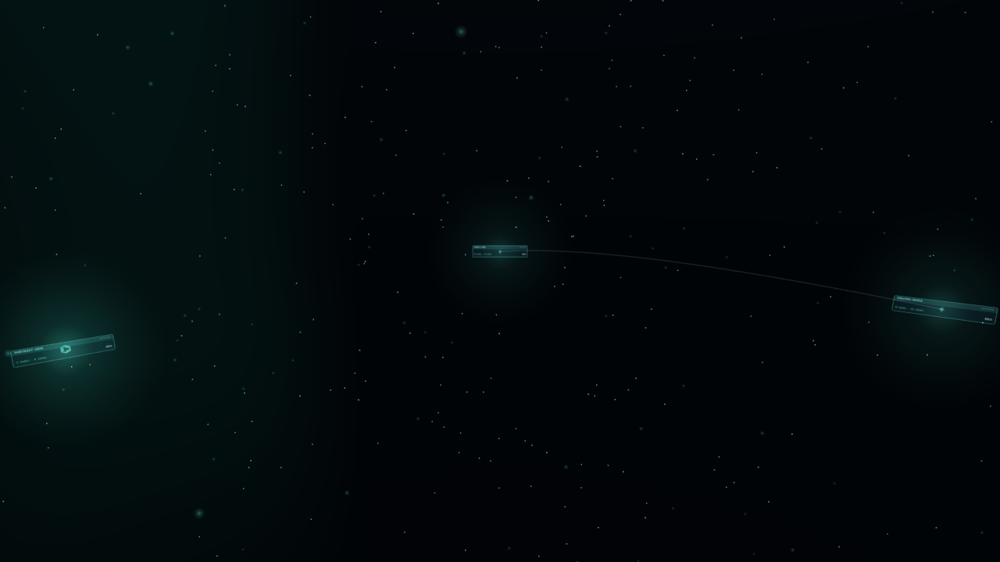
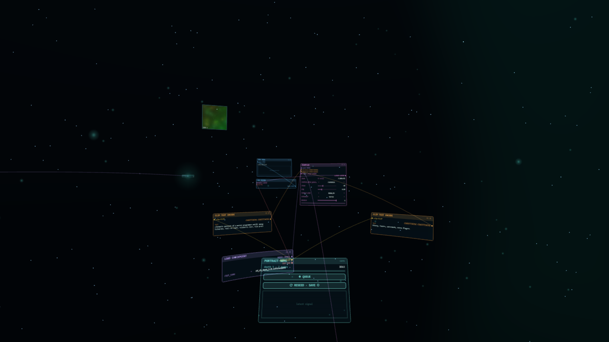
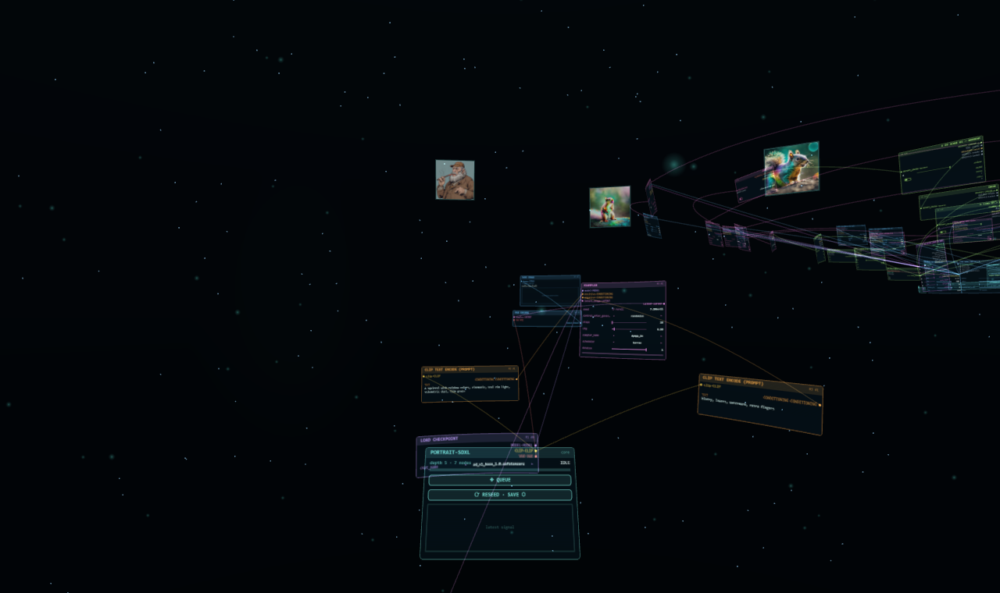

# comfyvr

A spatial frontend for ComfyUI. Your workflows become hubs in a dark
constellation; fly into one and it unfolds into an amphitheater — one
concentric ring per topological depth of the graph, holographic panels
curved toward the core, links as arcs of light. When you queue, real
pulses climb the real wires: ComfyUI's websocket drives panel glow, live
progress, preview frames at the hub's heart, and finished images accrete
onto a gallery rim above the graph that made them.

Not a video. Not a custom node (yet). A separate UI that talks to a
stock ComfyUI over its API — your workflow files stay vanilla-compatible.





## What works

- **Two views**: constellation (workflows as sigils, threads between hubs
  that share a checkpoint) and amphitheater (the DAG as concentric rings,
  panel colors flowing with link types: MODEL purple at the core out to
  IMAGE blue at the rim).
- **Real editing**: widgets are live (sliders, combos, seed reroll, text),
  drag a panel's title bar to move it (wheel pulls it between rings), grab
  port dots to rewire or detach links, drop a beam into empty space and a
  palette grows a new node there, wired.
- **Real execution**: QUEUE converts to API format and submits; websocket
  events drive pulses, progress, live previews, and gallery accretion.
- **Provenance**: drop any ComfyUI PNG into the space and its embedded
  workflow unfolds as a new hub with the image on its rim. Images
  generated through comfyvr embed their workflow too.
- **History recall**: on load, recent generations from `/history` find
  their hubs and hang on the rims.
- **Demo mode**: no backend running → simulated execution, procedural
  imagery. The space works cold.
- **WebXR**: an `◈ ENTER VR` button appears when a headset runtime is
  reachable. Controller rays drive the same interactions as the mouse;
  on Quest, hand-tracked pinch fires the same events, so bare hands work
  wherever controllers do. Left stick flies, right stick snap-turns.

## Run it

Requires Python 3.10+ with `aiohttp`, and (optionally) a ComfyUI instance.

```
python server.py [--port 8189] [--backend http://127.0.0.1:8188]
```

Open http://localhost:8189. The server serves the frontend and proxies
`/api/*` + `/ws` to ComfyUI, so there is no CORS story. If the backend is
down you get demo mode.

Workflows come from two places: the local `workflows/` folder, and (live)
whatever you saved in the ComfyUI frontend (userdata). Edits SAVE to the
local folder only — comfyvr never overwrites your ComfyUI-side files.

## VR

WebXR needs a secure context:

- **PCVR** (Rift/Index/WMR on the same machine): open localhost:8189 in
  Chrome and click ENTER VR. localhost is exempt, nothing to set up.
- **Quest**: `adb reverse tcp:8189 tcp:8189` over USB, then open
  http://localhost:8189 in the Quest browser. (Or tunnel https.)
  On Windows, `quest.ps1` does the waiting, the tunnel, and prints the
  in-headset steps.

Text entry stays on the desktop for now — a phone-as-keyboard companion
is planned, because typing prompts in VR is nobody's dream.

## Status

Early and moving fast. Rough edges: no node delete yet, the accrete
palette searches loaded schemas rather than all of object_info, dense
graphs get beam-crossy, and the in-headset pass is young. Design notes
and roadmap live in `notes/design.md`.
